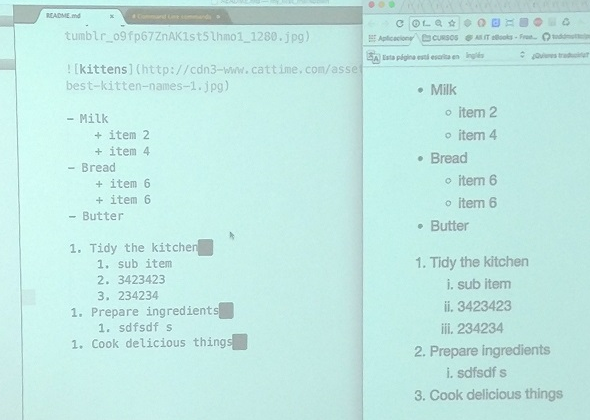

#Today 10.04

know Sublime, open, new file, close, save and packs

##Basics Commands [Cmender](##Commands http://bliker.github.io/cmder.)

-   ``cd`` for change directory
-   ``cd..`` up level directory
-   ``ls`` list contein
-   ``ls -a`` list contein + hidden files
-   ``ls  -la`` detalles archivos y carpetas
-   ``mkdir`` create folder directory
-   ``touch`` create directory
-   ``rmdir`` delete folder
-   ``rm -rf`` delete folder and files
-   ``mv 'filename1' 'C:\folder\filename2'`` move files or foldes

#Bacis Commands [Markdown](https://github.com/adam-p/markdown-here/wiki/Markdown-Cheatsheet)

## otro título de prueba
###otro titulo
###otro titulo más

*esto es en cursiva*
**negrita **
***en negrita cursiva***

[esto es un enlace](https://github.com/SublimeText-Markdown/MarkdownEditing) utilizando la combinacion de teclas "*ctrl + wind + v*" una vez tenemos copiado el enlace.

para realizar el enlace de una imagen es lo mismo que el link, pero poniendo el simbolo de admiración al principio.

Esto es un ejemplo de una foto del curso: 

Crear una lista desordenada:

- Llista uno
- Lista dos
	+ listado 2.5
			- listado otro
- Lista tres

Crear una lista ordenada:

1. primero de la lista
 	-	otra lista
2. 	otra lista
3. segundo de la lista
*	listado
	*	listado
		-	otro
4. tercero de la lista

Si queremos documentar código debemos usar esto " ` " tres veces a cada lado e indicando el lenguaje.

```javascript
function sum(a,b){
	return a+b;
}
```

### Repositorios y trabajar con GIT local.

Hay tres estados.

*	Working Copy (directorio de trabajo)
*	Stage area (direcctorio previo commint)
*	Repo "*git commit -m "mensaje descriptivo*" (Para añadir al repositorio)


Crear cuenta para git.
```
$ git config --global user.name "John Doe"
$ git config --global user.email "john@doe.org"
```

Después de generar el directorio y archivo a trabajar:

1. 	*git init* (inicializamos proyecto git).
2. 	*git add* (añadimos archivos).
3. 	*git commit -m "y comentario descriptivo"*
4. 	*git status* (saber el estado en el cual esta o estan los archivos).
5. 	*git --all* para añadir y commitear todo.
6. 	*git diff* te indica los cambios realizados.
7. 	*git log* para historial de los commits del repositorio.
8. 	Si tienes algún error al generar el git init (ejemplo, te equivocastes de directorio, usa este comando en el directorio erroneo ```rm -rf .git```)

Al inicializar repositorio con el comando  ```git init``` este genera una carpeta git oculta. Nunca borrarla!.

# Comandos utilies Git.

```
 git
usage: git [--version] [--help] [-C <path>] [-c name=value]
           [--exec-path[=<path>]] [--html-path] [--man-path] [--info-path]
           [-p | --paginate | --no-pager] [--no-replace-objects] [--bare]
           [--git-dir=<path>] [--work-tree=<path>] [--namespace=<name>]
           <command> [<args>]

These are common Git commands used in various situations:

start a working area (see also: git help tutorial)
   clone      Clone a repository into a new directory
   init       Create an empty Git repository or reinitialize an existing one

work on the current change (see also: git help everyday)
   add        Add file contents to the index
   mv         Move or rename a file, a directory, or a symlink
   reset      Reset current HEAD to the specified state
   rm         Remove files from the working tree and from the index

examine the history and state (see also: git help revisions)
   bisect     Use binary search to find the commit that introduced a bug
   grep       Print lines matching a pattern
   log        Show commit logs
   show       Show various types of objects
   status     Show the working tree status

grow, mark and tweak your common history
   branch     List, create, or delete branches
   checkout   Switch branches or restore working tree files
   commit     Record changes to the repository
   diff       Show changes between commits, commit and working tree, etc
   merge      Join two or more development histories together
   rebase     Reapply commits on top of another base tip
   tag        Create, list, delete or verify a tag object signed with GPG

collaborate (see also: git help workflows)
   fetch      Download objects and refs from another repository
   pull       Fetch from and integrate with another repository or a local branch
   push       Update remote refs along with associated objects

'git help -a' and 'git help -g' list available subcommands and some
concept guides. See 'git help <command>' or 'git help <concept>'
to read about a specific subcommand or concept.
```

# Repositorio remoto, GitHub (en la nube)

Para sincronizar con el local GitHub

Usaremos el comando ``git remote add``

``git push origin master``` para poner todos los cambios en el repositorio remoto``

Usaremos el comando ```git remote add```

Para poner todos los cambios en el repositorio remoto ```git push origin master```

# 11/04

### Acabando con Git & GitHub


***Notes***:

Si no introduces ningún comentario cuando haces commit (gi commit -m "mensaje")
Hay que hacer esto: (ya que estamos en un editor que se maneja con linea de comandos.)
`Esc + :
q!` --> A veces con dar solo a la 'q' ya es válido.

Para volver a un estado anterior se usa el comando `git checkout` el hash
y para volver al archivo inicial es `git checkout master`
Para renombrar ficheros usamos el comando `mv` :

`mv gitbasics.md git_basics_command.md`

`git add --all`

`git commit -m "file name change"`

# Para subirlo online:

Creamos el repositorio en github.com
Después en linea de comandos:

`git remote add origin https://github.com/tonimg/git_notes.git`

revisar estado
`git remote -v`

subirlo:
`git push -u origin master`
