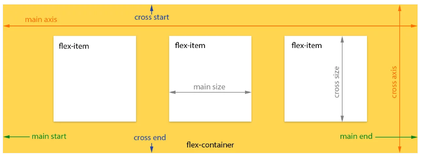

# Today 19.04

## [CSS3](https://skylabcoders.github.io/bootcamp-abril2017/?full#css3)

**Resumen dia de antes**

### Block Elements and Inline Elements

-   Block elements (we do not can change the dimensions, y empuja al resto hacia abajo "natural flow"):
    +   Section
    +   Article
    +   Figure
    +   Nav
    +   P
    +   H1 > H6
    +   Aside
    +   Footer
    +   ul - ol - li
    +   Table
    +   Etc...
        *   In CSS:
            -   Display: (`block`, `inline`, `inline-block`)

-   Inline elements (we do not can change the dimensions, this elemnts is only his line):
    +   Img
    +   A
    +   Stron
    +   Span
    +   Em
    +   In CSS:
        *   Display (`inline-block`)

---

Continue with CSS3 [positioning property](https://skylabcoders.github.io/bootcamp-abril2017/?full#85), we have so the [position property](http://learn.shayhowe.com/advanced-html-css/detailed-css-positioning/). By default, position has the relative.
When I put the **position** at `relative`, we have available more possibilities, for example move where you want and the rest of elements mantein your original position.
Position `absolute`, the point of the reference put the diferents objects follow the father with relative position property, if no there, the position will by reference with the body. 
And the last property is the position `fix` elements will always be present in the viewport and it does not scroll with the page.

## [Flex Box](https://skylabcoders.github.io/bootcamp-abril2017/?full#87)

Display Flex al padre y los hijos dejan de comportarse como bloques y pasan a adaparse al espacio disponible.
Un contenedor flex los expande para que ocupen el espacio disponible o los encoge.



### Flex property:

*   Propiedades padre:

|property|value|value|value|value|value|value|value|
|---    |---    |---    |---    |---    |---    |---    |
|[flex-direction]|row|row-reverse|column|column-reverse|initial|inherit|
|[flex-direction]|row|row-reverse|column|column-reverse|initial|inherit|
|[flex-wrap]|nowrap|wrap|wrap-reverse|initial|inherit|       |
|[justify-content]|flex-start|flex-end|center|space-between|space-around|initial|inherit|
|[align-items]|stretch|center|flex-start|flex-end|baseline|initial|inherit|
|initial|inherit|       |       |       |       |       |       |
|[align-content]|       |       |       |       |       |       |       |
|       |       |       |       |       |       |       |       |


    -   |[flex-direction](https://www.w3schools.com/cssref/css3_pr_flex-direction.asp)| row|row-reverse|column|column-reverse|initial|inherit
    |[flex-direction](https://www.w3schools.com/cssref/css3_pr_flex-direction.asp)|row|row-reverse|column|column-reverse|initial|inherit
    |[flex-wrap](https://www.w3schools.com/cssref/css3_pr_flex-wrap.asp)|nowrap|wrap|wrap-reverse|initial|inherit
    |[justify-content](https://www.w3schools.com/cssref/css3_pr_justify-content.asp)|flex-start|flex-end|center|space-between|space-around|initial|inherit
    |[align-items](https://www.w3schools.com/cssref/css3_pr_align-items.asp)|stretch|center|flex-start|flex-end|baseline|initial|inherit
    |[align-content](https://www.w3schools.com/cssref/css3_pr_align-content.asp)|stretch|center|flex-start|flex-end|space-between|space-around|initial|inherit

*   Propiedades hijos:

|  Property | Value|Value|Value|Value|value
| [order](https://www.w3schools.com/cssref/css3_pr_order.asp)  |number   | initial  | inherit  
|  [align-self](https://www.w3schools.com/cssref/css3_pr_align-self.asp) |auto|stretch|center|flex-start|flex-end|baseline|initial|inherit

### Exercises [CSS3 Challenges](https://skylabcoders.github.io/bootcamp-abril2017/?full#96)

### CSS3 MediaQuery

MediaQuery establecer reglas en el css cuando cumpla una condición se active con la propiedad @media
Por ejemplo:

```css
@media (max-width: 600px) {
  .facet_sidebar {
    display: none;
  }
}
```

Aquí se activará cuando el máximo de la pantalla sea 600px. Tambien se puede establecerun rango.

```
@media (max-width: 500px) and (max-width: 600px)
  .facet_sidebar {
    display: none;
  }
}
```
Aquí se activará dentro de ese rango.
Si añadimos la propiedad flex se adaptará todo el contenido al cumplir la condición.

```
@media (min-width: 600px)
  .facet_sidebar {
    display: flex;
  }
}
```

