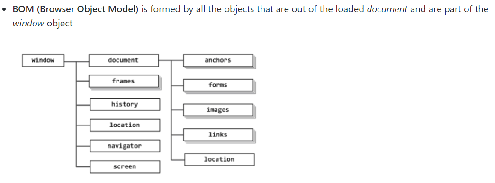

## Today 24.04 

# [JQuery](https://skylabcoders.github.io/bootcamp-abril2017/?full#jquery)

In JavaScript 
Dos objetos principales.

## [BOM](https://github.com/juanmaguitar/javascript-notes/tree/master/markdown-en/11-browser-environment/BOM#bom)
[Browser Object Model](https://github.com/juanmaguitar/javascript-notes/tree/master/markdown-en/11-browser-environment/BOM#bom), formado por todos los objetos que forman parte de la ventana (fuera del documento).

## Window properties

Algunas propiedades interesantes:

- window.navigator
- window.location
- window.history
- window.frames 
- window.screen

## Window methods

Algunos metodos interesantes:

- window.open(), window.close()
- window.moveTo(), window.moveBy(), window.resizeTo(), window.resizeBy()
- window.alert(), window.prompt(), window.confirm()
- window.setTimeout(), window.setInterval()

Esquema como funciona:

Si necesitamos asignar algo al entorno global en JavaScript, es mejor utilizar la propieda window.(y nuestra variable global). en vez de var...

[window.document](https://developer.mozilla.org/en/DOM/window.document) is a BOM object with info about the current document All the methods and properties inside window.document beong to the DOM objects category.

## [DOM](https://github.com/juanmaguitar/javascript-notes/tree/master/markdown-en/11-browser-environment/DOM#dom) 
Document Objet Model, metodos y propiedades que podemos interactuar con el HTML. **Representa el HTML como un arbol de nodos**.

Para interactuar con el **DOM** usamos **JQuery**.
The first all put the [JQuery](https://jquery.com/) in our web page or download or CDN. Better 2 up version.

Para escribir en JQuery, va delante de un selector. el simbolo dolar ``$`` es un alias de JQuery, por lo tanto podremos llamarlo de las dos maneras, solo ue para escribir menos usamos el simbolo dolar ``$``.

Para acceder al selector podemos hacerlo de diferentes maneras:

**Truco** para saber si JQuery te devuelve algo es utilizar el sector con el .length. Ejemplo : ``$('li').length``. 

A parte de los selectores nuestros y HTML, tambien tiene unos [selectores  predefinidos](http://learn.jquery.com/using-jquery-core/selecting-elements/#selecting-by-type):

- [:password](http://api.jquery.com/password-selector/)
- [:reset](http://api.jquery.com/reset-selector/)
- [:radio](http://api.jquery.com/radio-selector/)
- [:text](http://api.jquery.com/text-selector/)
- [:submit](http://api.jquery.com/submit-selector/)
- [:checkbox](http://api.jquery.com/checkbox-selector/)
- [:button](http://api.jquery.com/button-selector/)
- [:image](http://api.jquery.com/image-selector/)
- [:file](http://api.jquery.com/file-selector/)

## [Manipulating Elements](http://learn.jquery.com/using-jquery-core/manipulating-elements/)

### [Get and Obtein information](http://learn.jquery.com/using-jquery-core/manipulating-elements/#getting-and-setting-information-about-elements):

-   ``.html()`` – Get or set the HTML contents
-   ``.text()`` – Get or set the text contents; HTML will be stripped
-   ``.attr()`` – Get or set the value of the provided attribute
-   ``.width()`` – Get or set the width in pixels of the first element in theselection as an integer.
-   ``.height()`` – Get or set the height in pixels of the first element inthe selection as an integer.
-   ``.position()`` – Get an object with position information for the firstelement in the selection, relative to its first positioned ancestor. This is a getter only.
-   ``.val()`` – Get or set the value of form elements.

### [Moving, Copying, and Removing Elements](http://learn.jquery.com/using-jquery-core/manipulating-elements/#moving-copying-and-removing-elements):

- ``.append()`` - se selectiona primero el padre y despues el elemento a mover (``$( "#myList" ).append( $( "#myList li:first" ) );``).
- ``.appendTo()`` - sellecionamos el elemento y despues el padre (``var li = $( "#myList li:first" ).appendTo( "#myList" );``).
- clone() - Creamos un elemento que existe y lo colocamos done queremos mostrarlo (``$( "#myList li:first" ).clone().appendTo( "#myList" );``).
- ``.eq()`` - Movemos los elementos (``$( "#myList li:first" ).eq(2)``).
- ``.remove()`` - Eliminar elementos. 

