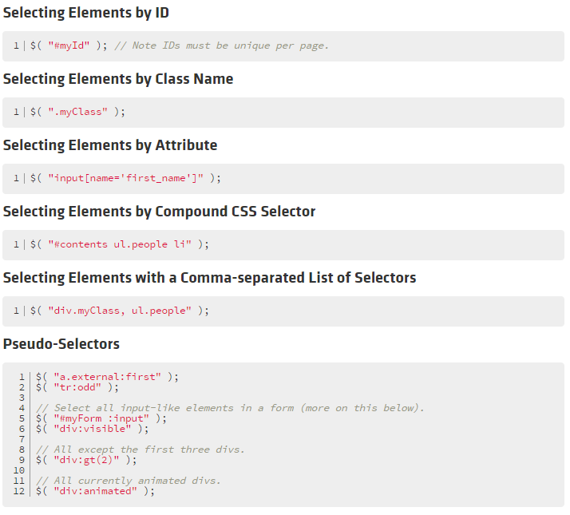

## Today 24.04 


# [JQuery](https://skylabcoders.github.io/bootcamp-abril2017/?full#jquery)

In JavaScript 
Dos objetos principales.

## [BOM](https://github.com/juanmaguitar/javascript-notes/tree/master/markdown-en/11-browser-environment/BOM#bom)
[Browser Object Model](https://github.com/juanmaguitar/javascript-notes/tree/master/markdown-en/11-browser-environment/BOM#bom), formado por todos los objetos que forman parte de la ventana (fuera del documento).

## Window properties

Algunas propiedades interesantes:

- window.navigator
- window.location
- window.history
- window.frames 
- window.screen

## Window methods

Algunos metodos interesantes:

- window.open(), window.close()
- window.moveTo(), window.moveBy(), window.resizeTo(), window.resizeBy()
- window.alert(), window.prompt(), window.confirm()
- window.setTimeout(), window.setInterval()

Esquema como funciona:


Si necesitamos asignar algo al entorno global en JavaScript, es mejor utilizar la propieda window.(y nuestra variable global). en vez de var...

[window.document](https://developer.mozilla.org/en/DOM/window.document) is a BOM object with info about the current document All the methods and properties inside window.document beong to the DOM objects category.

## [DOM](https://github.com/juanmaguitar/javascript-notes/tree/master/markdown-en/11-browser-environment/DOM#dom) 
Document Objet Model, metodos y propiedades que podemos interactuar con el HTML. **Representa el HTML como un arbol de nodos**.


Para interactuar con el **DOM** usamos **JQuery**.
The first all put the [JQuery](https://jquery.com/) in our web page or download or CDN. Better 2 up version.

Para escribir en JQuery, va delante de un selector. el simbolo dolar ``$`` es un alias de JQuery, por lo tanto podremos llamarlo de las dos maneras, solo ue para escribir menos usamos el simbolo dolar ``$``.

Para acceder al selector podemos hacerlo de diferentes maneras:



**Truco** para saber si JQuery te devuelve algo es utilizar el sector con el .length. Ejemplo : ``$('li').length``. 

A parte de los selectores nuestros y HTML, tambien tiene unos [selectores  predefinidos](http://learn.jquery.com/using-jquery-core/selecting-elements/#selecting-by-type):

- [:password](http://api.jquery.com/password-selector/)
- [:reset](http://api.jquery.com/reset-selector/)
- [:radio](http://api.jquery.com/radio-selector/)
- [:text](http://api.jquery.com/text-selector/)
- [:submit](http://api.jquery.com/submit-selector/)
- [:checkbox](http://api.jquery.com/checkbox-selector/)
- [:button](http://api.jquery.com/button-selector/)
- [:image](http://api.jquery.com/image-selector/)
- [:file](http://api.jquery.com/file-selector/)

## [Manipulating Elements](http://learn.jquery.com/using-jquery-core/manipulating-elements/)

### [Get and Obtein information](http://learn.jquery.com/using-jquery-core/manipulating-elements/#getting-and-setting-information-about-elements):

-   ``.html()`` – Get or set the HTML contents
-   ``.text()`` – Get or set the text contents; HTML will be stripped
-   ``.attr()`` – Get or set the value of the provided attribute
-   ``.width()`` – Get or set the width in pixels of the first element in theselection as an integer.
-   ``.height()`` – Get or set the height in pixels of the first element inthe selection as an integer.
-   ``.position()`` – Get an object with position information for the firstelement in the selection, relative to its first positioned ancestor. This is a getter only.
-   ``.val()`` – Get or set the value of form elements.

### [Moving, Copying, and Removing Elements](http://learn.jquery.com/using-jquery-core/manipulating-elements/#moving-copying-and-removing-elements):

- ``.append()`` - se selectiona primero el padre y despues el elemento a mover (``$( "#myList" ).append( $( "#myList li:first" ) );``).
- ``.appendTo()`` - sellecionamos el elemento y despues el padre (``var li = $( "#myList li:first" ).appendTo( "#myList" );``).
- clone() - Creamos un elemento que existe y lo colocamos done queremos mostrarlo (``$( "#myList li:first" ).clone().appendTo( "#myList" );``).
- ``.eq()`` - Movemos los elementos (``$( "#myList li:first" ).eq(2)``).
- ``.remove()`` - Eliminar elementos. 

--------------------------------------------------------------------------------------------------

-   Example JQuery dinamic list:

```html
<!DOCTYPE html>
<html lang="en">
<head>
  <meta charset="UTF-8">
  <title>Document</title>
  <!-- Latest compiled and minified CSS -->
  <link rel="stylesheet" href="https://maxcdn.bootstrapcdn.com/bootstrap/3.3.6/css/bootstrap.min.css" integrity="sha384-1q8mTJOASx8j1Au+a5WDVnPi2lkFfwwEAa8hDDdjZlpLegxhjVME1fgjWPGmkzs7" crossorigin="anonymous">
  <style type="text/css">
  </style>
</head>
<body>
  <div class="container">
    <ul class="list-group" id="myList"></ul>
  </div>
  <script type="text/javascript" src="https://code.jquery.com/jquery-3.2.1.js"></script>
  <script type="text/javascript">
    var beatles = ['john','paul','george','ringo']
    var htmlList = ''
    beatles.forEach( function(name, i) {
      htmlList += '<li class="list-group-item">' + name + '</li>'
      console.log(htmlList)
    })
    console.log( typeof htmlList )
    $('#myList').html(htmlList)
  </script>
</body>
</html>
```
Output: [jquery_dynamic_list](examples/jquery_dynamic_list.html)

-   Example list elements several ways:

```html
<!DOCTYPE html>
<html lang="en">
<head>
  <meta charset="UTF-8">
  <title>Document</title>
  <!-- Latest compiled and minified CSS -->
  <link rel="stylesheet" href="https://maxcdn.bootstrapcdn.com/bootstrap/3.3.6/css/bootstrap.min.css" integrity="sha384-1q8mTJOASx8j1Au+a5WDVnPi2lkFfwwEAa8hDDdjZlpLegxhjVME1fgjWPGmkzs7" crossorigin="anonymous">
  <style type="text/css">
    .highlight { background: black; color: white; }
  </style>
</head>
<body>
  <div class="container">
    <ul class="list-group" id="myList"></ul>
  </div>
  <script type="text/javascript" src="https://code.jquery.com/jquery-3.2.1.js"></script>
  <script type="text/javascript">
    // *** Way 1 ***
    // var liItems = []
    // for (var i=1; i<=20; i++) {
    //   liItems.push('<li class="list-group-item">' + i + '</li>')
    // }
    // $("#myList").html( liItems.join('') )
    // *** Way 2 ***
    // for (var i=1; i<=20; i++) {
    //   $('#myList').append( $('<li class="list-group-item">item ' + i + '</li>') )
    // }
    // *** Way 3 ***
    // for (var i=1; i<=20; i++) {
    //   var $item = $('<li class="list-group-item">row ' + i + '</li>')
    //   $item.appendTo('#myList')
    // }
    // *** Way 4 ***
    // var listHtml = ''
    // for (var i=1; i<=20; i++) {
    //   listHtml += '<li class="list-group-item">elem ' + i + '</li>'
    // }
    // $("#myList").html(listHtml )
    // *** Way 5 ***
    var listHtml = new Array(20).fill(0).map(function(_,i) { return '<li class="list-group-item">elem ' + (i+1) + '</li>'})
    $("#myList").html(listHtml )
    var $listElemes = $("#myList li");
    $listElemes.filter(':even').addClass('highlight')
  </script>
</body>
</html>
```

Output: [List elements several ways](examples/list_elems_several_ways.html)

---

### [Parents](http://learn.jquery.com/using-jquery-core/traversing/#parents)

Para acceder al padre de un elemento.

-   ``.parent()``
-   ``.parents()``
-   ``.parentsUntil()``
-   [``.closest()``](https://developer.mozilla.org/en-US/docs/Web/API/Element/closest): returns the closest ancestor of the current element (or the current element itself) which matches the selectors given in parameter.

### [Children](http://learn.jquery.com/using-jquery-core/traversing/#children)

Para acceder al hijo de un elemento.

- .``children()``
- ``.find()``

### [Siblings](http://learn.jquery.com/using-jquery-core/traversing/#siblings)

Para acceder al hermano de un elemento.

- ``.prev()``
- ``.next()``
- ``.siblings()``
- ``.nextAll()``
- ``.nextUntil()``
- ``.prevAll()``
- ``.prevUntil()``


### [Utility Methods](http://learn.jquery.com/using-jquery-core/utility-methods/)

- [$.trim()](http://learn.jquery.com/using-jquery-core/utility-methods/#trim-)
- [$.each()](http://learn.jquery.com/using-jquery-core/utility-methods/#each-)
- [$.inArray()](http://learn.jquery.com/using-jquery-core/utility-methods/#inarray-)
- [$.extend()](http://learn.jquery.com/using-jquery-core/utility-methods/#extend-)
- [$.proxy()](http://learn.jquery.com/using-jquery-core/utility-methods/#proxy-)
- [$.type()](http://learn.jquery.com/using-jquery-core/utility-methods/#testing-type)


[Exercices](https://skylabcoders.github.io/bootcamp-abril2017/?full#117) and [next slide](https://skylabcoders.github.io/bootcamp-abril2017/?full#118).


