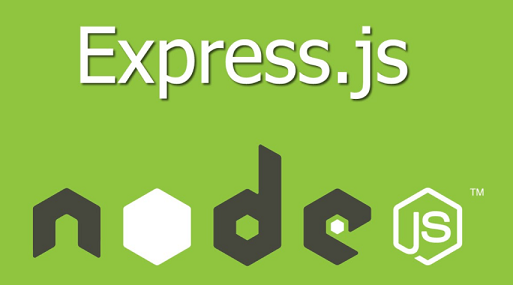

## Today 15.05

Expres es un Framework de los más extendidos de Node.js.
[Here](http://www.nodehispano.com/2012/01/express-el-framework-web-para-nodejs/) more information:

### First Steps

1. [Installing Express](http://expressjs.com/en/starter/installing.html)
1. [Hello world example](http://expressjs.com/en/starter/hello-world.html)
1. [Express application generator](http://expressjs.com/en/starter/generator.html)
1. [Basic routing](http://expressjs.com/en/starter/basic-routing.html)
    + [GET](https://en.wikipedia.org/wiki/Hypertext_Transfer_Protocol#Request_methods)
        * Only read. Request a representation of the specified resource
    + [POST](https://en.wikipedia.org/wiki/Hypertext_Transfer_Protocol#Request_methods)
        * Send information
    +   [PUT](https://en.wikipedia.org/wiki/Hypertext_Transfer_Protocol#Request_methods)
        *   add and update the information 
    +   [DELETE](https://en.wikipedia.org/wiki/Hypertext_Transfer_Protocol#Request_methods)
        *   Erase the id 
1. Serving static files in Express

**Nodemon** for we can the change in realtime ``nodemon app.js``

``SET DEBUG=second-express-project:* & npm start``

### CURL

With [CURL](http://stackoverflow.com/questions/9507353/how-do-i-install-set-up-and-use-curl-on-windows#16216825) you can simulate petitions from the command line
With [PostMan](https://chrome.google.com/webstore/detail/postman/fhbjgbiflinjbdggehcddcbncdddomop), you can simulate petitions from visual environment 

- Pasos para crear un nuevo proyecto node.

    1. creamos carpeta proyecto
    2. generamos npm init -y (package json vacio)
    3. npm install name_package --save (para install and add al package json)

Conversor HTML to PUG [here](http://html2jade.org/).

### [bower](https://bower.io/)

Bower can manage components that contain HTML, CSS, JavaScript, fonts or even image files. Frontend dependicies.

Steps:

1. ``npm install bower -g`` install manage package 

1. ``bower init`` --> para generar el archivo package.json
1. ``bower install <package>`` --> Install packages

### Exercices

- [bower](bower)
- [Express_Boostrap_content](Express_Boostrap_content)
- [Express_Boostrap_local_content](Express_Boostrap_local_content)
- [Express_dinamic_content](Express_dinamic_content)
- [First_Express_Project](First_Express_Project)

