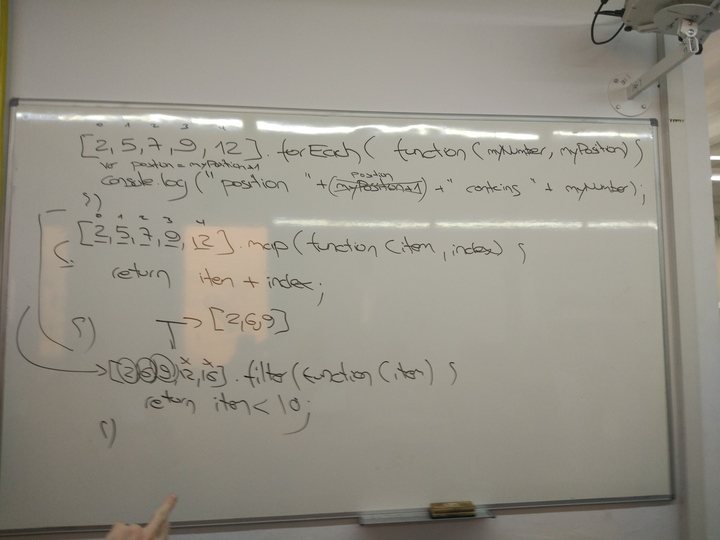

# Today 13.04

### Practice
*Practicas con los ejercicios proporcionados sobre JavaScript*

---

**Recordar tipos de datos primitivos de JavaScript:**
1.  undefined
2.  NaN
3.  Null
4.  false
5.  0
6.  " " -->cadena vacia.


```javascript
var a; typeof a; // undefined
var s = '1s'; s++; // NaN
!!"false" // true
!!undefined // false
undefined == null // true // son dos valores iguales
false == "" // true, porque compara dos valores iguales.
false === "" // false, esta comparando valores y tipo y no son iguales.
typeof "2E+2" //
a = 3e+3; a++; //
```
---

*Que devuelve alerta y por que?:*
```javascript
var x = 'Hello World';
function foo(){
    var x;
    alert( x );
    x = 'New Value';
    alert( x );
}
foo();
```

Alert dará "New Value", ya que el scope de la función recorre la variable interna y es a la que dará uso.

```javascript
function test() {
    foo();
    bar();
    var foo = function () {
        alert("this won't run!");
    }
    function bar() {
        alert("this will run!");
    }
}
test();
```
Alert no dará resultado ya que la funcion foo() está realizada como variable. y hasta después de la linea de var foo, no la reconoce. Al estar antes peta.

```javascript
var a = 1;
function f() {
    var a = 2;
    function n() {
        alert(a);
    }
    n();
}
f();
```
La funcion n utiliza la variable del padre por lo que el resultado será 2.

---

**¿Cómo hariamos la operación (4 / 3) - 2 con este código en una linea?**

```javascript
var mathy = function(x) {
    return function (y) {
        return function (z) {
            return (x / y) - z;
        }
    }
}
```

Respuesta: *mathy(4)(3)(2)*

declaramos una variaboe como una función 

```
var superGreeter = function(greeting) {
    return function(place) {
        return function(nickname) {
            return function(name) {
                return greeting + ', ' + name + '! Welcome to ' + place + ', ' + nickname + '.';
            }
        }
    } 
};
­
superGreeter('Hey')('Berlin')('old pal')('Hans')
//'Hey, Hans! Welcome to Berlin, old pal.'
­
hiParisBuddyGreeter = superGreeter('Hi')('Paris')('buddy');
helloTokyoGreeter = superGreeter('Hello')('Tokyo');
­
hiParisBuddyGreeter('Franz')
//'Hi, Franz! Welcome to Paris, buddy.'
helloTokyoGreeter('friend')
//[Function]
helloTokyoGreeter('friend')('Yuki')
//'Hello, Yuki! Welcome to Tokyo, friend.'
```

### Metodos de array podemos hacer...

-   con pop podemos quitar el ultimo elemento
-   con shift podemos quitar el primer elemento
-   con join podemos unirlos y formar un string
-   con sort podemos ordenarlos.
-   con filter otro array con un filtrado
-   con map se obtiene otro array con cada uno de sus elementos modificados(sumados, restados, multiplicados...).
-   con el slice podemos estraer un trozo o sustituir.
-   con indexOf, podemos averiguar la posicion de algun eleento.
-   con reduce podemos sumar todos los elementos del array
-   con concat podemos generar un nuevo array con más elementos.
-   con push podemos añadir elementos al array.
-   con forEach opera con cada elemento del array.
-   con every averigua que todos los elementos sea false o true.
-   con some averigua si algun elemento es true o false.

*Ejemplo*:



*Otro ejemplos correspondientes a las notas de unos alumnos*:

```javascript
var scores = [5,3,4,1,7,3,5,2,7,2,9,4] // notas 12 alumnos

var newScores = scores.map( function(score) { return score + 1 })
var havePassedAll = newScores.every( function(score) { return score >= 5 })
var isThereSome10 = newScores.some( function(score) { return score === 10 })
var failedScores = newScores.filter( function(score) { return score < 5 })
var averageScore = newScores.reduce( function(acc, item) {
  return acc + item
},0) / newScores.length

// -------------------------------------

function addOne(score) { return score + 1 }
var addOne = score => score++

// --------------[ENMACSCRIPT2015]--------------------

var newScores = scores.map( score => score + 1 )
var havePassedAll = newScores.every( score => score >= 5 ) // true or false
var isThereSome10 = newScores.some( score => score === 10 ) // true or false
var failedScores = newScores.filter( score => score < 5  ) 

```

*Otro ejemplo*:

```javascript
var scores = [5,3,4,1,7,3,5,2,7,2,9,4] // 12

var scores = [
  {
    student: "julian",
    score: 4
  },
  {
    student: "maria",
    score: 8
  },
  {
    student: "paco",
    score: 2
  },
  {
    student: "luisa",
    score: 9
  }
]

var newScores = scores.map( function(score) { return score + 1 })
var havePassedAll = newScores.every( function(score) { return score >= 5 })
var isThereSome10 = newScores.some( function(score) { return score === 10 })
var failedScores = newScores.filter( function(score) { return score < 5 })

var averageScore = newScores.reduce( function(acc, item) {
  return acc + item
},0) / newScores.length

// -------------------------------------

function addOne(score) { return score + 1 }
var addOne = score => score++

// -------------------------------------

// var newScores = scores.map( score => score + 1 )
// var havePassedAll = newScores.every( score => score >= 5 ) // true or false
// var isThereSome10 = newScores.some( score => score === 10 ) // true or false
// var failedScores = newScores.filter( score => score < 5  )
```

*otro ejemplo*:

```javascript
function showPassedStudentNames ( student ) {
  if (student.score >= 5) console.log(student.name)
}

function addOneToScore( student ) {
  student.score++;
  return student;
}

// show names of students that have passed
students.forEach( showPassedStudentNames )

// show names of students that have passed after adding 1 to scores
students
  .map( addOneToScore )
  .forEach( showPassedStudentNames )

students
  .map( addOneToScore )
  .filter( function(student) { return student.score >= 5 })
  .map( function(student) { return student.name })
  .join(" - ")

var students = [
  {
    name: "julian",
    score: 4
  },
  {
    name: "maria",
    score: 8
  },
  {
    name: "paco",
    score: 2
  },
  {
    name: "luisa",
    score: 9
  }
]
```

*otro ejemplo*

```javascript
function addOneToScore( student ) {
  student.score++;
  return student;
}

var addOneToScore = function( student ) {
  student.score++;
  return student;
}

typeof addOneToScore === "function"
```

---

### [Prototype](https://github.com/juanmaguitar/javascript-notes/tree/master/markdown-en/09-prototype)

Las funciones como objetos que son, tienen una propiedad prototype (new) y se puede acceder a el como si una propiedad se tratara.
prototype chain (similar a las scope chain)

*   Objetos se componen en:
    *   pares:(claves y valor)

---


