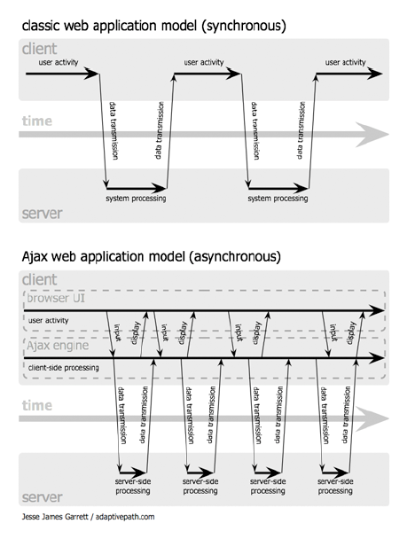

## Today 26.04 

Si tenemos un option en un select, podemos obtener valores desde JQuery y accedemos al value.

```html
<select name="" id="employees-list">
    <option value="1">Roxie Maiers</option>
    <option value="2">Rosana Fuss</option>
    <option value="3">Jeannetta Minjares</option>
    <option value="4">Candra Heavener</option>
    <option value="5">Lexie Nejaime</option>
</select>
```


``$('#employees-list').val`` --> get the **value** select in the form instead the name. This case is interesting if you only want obtein the ID o value.

--------------------------------------------------------------------------------------------------------------------------------------------------------

Excercise: [Data Jquery Select](Data Jquery Select/index.html)

Excercise: [jQuery Percentage Calculator](Percentage_Calculator/index.html)


### [JSON](https://github.com/juanmaguitar/javascript-notes/tree/master/markdown-en/13-JSON)

(**J**avascript **O**bject **N**otation)

```javascript
{
    "name": "Eric Clapton",
    "occupation": "Guitar Hero",
    "bands": ["Cream", "Blind Faith"]
    }
```

JSON is a format for data exchange based on the literal notation of Javascript for the representation of objects, arrays, strings, booleans and numbers

[JSON.stringify](https://developer.mozilla.org/en-US/docs/Web/JavaScript/Reference/Global_Objects/JSON/stringify) --> Converts a Javascript object into a JSON string
[JSON.parse](https://developer.mozilla.org/en-US/docs/Web/JavaScript/Reference/Global_Objects/JSON/parse) --> Converts a JSON string in an Javascript object

### [AJAX](https://github.com/juanmaguitar/javascript-notes/tree/master/markdown-en/14-AJAX)

(**A**synchronous **J**avaScript + **X**ML)



With method [AJAX of JQuery](https://github.com/juanmaguitar/javascript-notes/tree/master/markdown-en/14-AJAX#ajax-with-jquery) we can get infromation asynchoronous, like example to below:

```java
$.ajax({
    url: 'ajax/test.html',
    success: function(data) {
        $('.result').html(data);
        alert('Load was performed.');
    }
});
```

For do the test, install our small server with this command into console 'CEMENDER': **npm install http-server -g**

In console 'cmder' go to the path of our project.
For up our local server put in console (``http-server``)
In the browser we put ``localhost:8080`` or ``http://127.0.0.1:8080/``

This test is in the foloww path [Demo Ajax Jquery Json](Demo Ajax Jquery Json/index.html)

### API

(**A**plication **P**rograming **I**nterface)

Exercises:
[Demo Api GitHub Plus](Demo API GitHub/index.html)
[Demo Api GitHub Plus](Demo-api-github-plus/index.html)
[Demo Api Spotify](Demo-api-Spotify/index.html)
