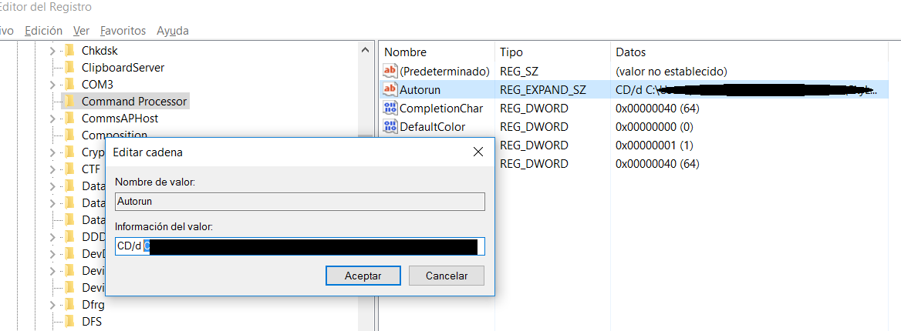

# Tips 

## Plugins Sublime:

Paste the above into your command line prompt and this will make the **subl** command available to you.

If you are using Sublime Text 3, use the following instead:

``doskey subl="C:\Program Files\Sublime Text 3\sublime_text.exe" $*``

-   Bootstrap 3 Snippet.
-   A File Icon
-   ColorPicker
-   AutoFileName
-   Autoprefixer
-   CSS3
-   Emmet
-   HTML-CSS.JS Prettify
-   LiveReload
-   Markdown Preview
-   MarkdownEditing
-   Sass
-   SulimeLinter
-   Unsplash
-   JavaScript Snippets

## Extension for Chrome:

- [JSON Formatter](https://chrome.google.com/webstore/detail/json-formatter/bcjindcccaagfpapjjmafapmmgkkhgoa?hl=es)
- LiveReload
- ColorZilla
- BootstrapGrip
- Clear Cache

## Git & GitHub

Después de generar el directorio y archivo a trabajar:

1.  *git init* (inicializamos proyecto git).
2.  *git add* (añadimos archivos).
3.  *git commit -m "y comentario descriptivo"*
4.  *git status* (saber el estado en el cual esta o estan los archivos).
5.  *git --all* para añadir y commitear todo.
6.  *git diff* te indica los cambios realizados.
7.  *git log* para historial de los commits del repositorio.
8.  Si tienes algún error al generar el git init (ejemplo, te equivocastes de directorio, usa este comando en el directorio erroneo ```rm -rf .git```)

 **Trabajar con proyectos en grupo con GitHub**

- ``git clone`` <- clonas repositorio remoto en local
- ``git push`` -> subes los cambios locales a remoto
- ``git pull`` <- actualiza las tablas locales y actualiza los archivos. Realiza esás dos opciones. (``git Feth`` (actualiza tablas) + ``git Merge``(añade cambios))

- ``git branch new_name`` (para crear ramas y ver ramas que hay creadas)
- ``git checkout new_name`` (para cambiar de rama y trabajar en ella.)
- ``git checkout master`` (para trabajar en la rama principal)

Para realizar un merge con la rama master, primero debemos de ir a la rama master y le decimos ``git merge new_name``

- ``git branch -d new_name`` -> (para borrar la rama)
- If we want ignored any file for Git, must be create a file whit the name ``.gitignore`` and into put the name of the folders and files for ignore the Git, in the same way there this explanation [web](https://www.gitignore.io/)


## Basics Commands Cmder [Cmender](##Commands http://bliker.github.io/cmder.)
Portable console emulator for Windows [cmder](http://cmder.net/)

A neat way integrate [Cmder and Sublime](https://laravel.io/forum/02-24-2014-a-neat-way-integrate-cmder-and-sublime-text-seamlessly) text seamlessly.

Change directory by default ([here](https://www.youtube.com/watch?v=3bBSVXAdeXg)
Open Regedit --> *HKEY_LOCAL_MACHINE\SOFTWARE\Microsoft\Command Processor* and we will create a **new** "Reg_Expand_SZ" (*valor cadena expandible*) with the name ``Autorun`` with the value ``CD/d C:\Users\tonim\OneDrive\Documentos\SkyLab Coders\Course\Backend``



-   ``cd`` for change directory
-   ``cd..`` up level directory
-   ``ls`` list contein
-   ``ls -a`` list contein + hidden files
-   ``ls  -la`` detalles archivos y carpetas
-   ``mkdir`` create folder directory
-   ``touch`` create directory
-   ``rmdir`` delete folder
-   ``rm -rf`` delete folder and files
-   ``mv 'filename1' 'C:\folder\filename2'`` move files or foldes


- Parsear webs [here](./Backend/0520%Semana/parsing_web.js) 
